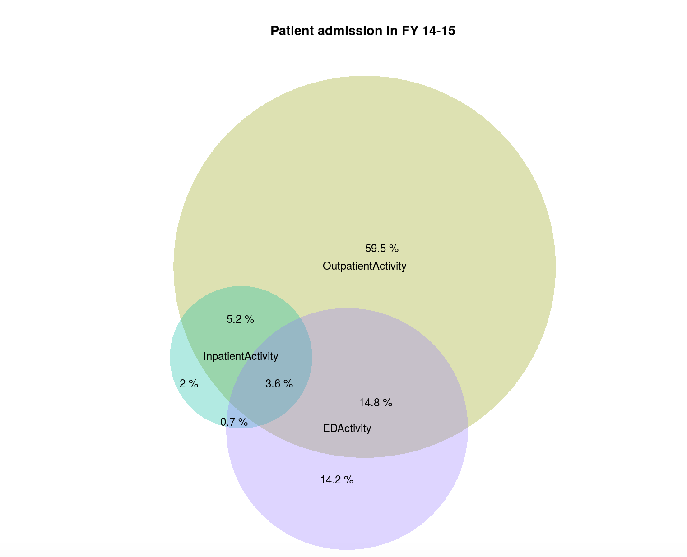

# Area-proportional Venn diagrams for Invision Patients


This shiny app is based on an R package called venneuler. It generates area-proportional venn diagrams.

### How to use the app:
This app is hosted in the shiny.io web server. This app can be accessed through any web browser using the link <https://tanzir.shinyapps.io/venn_for_invision_patients/>. It is not necessary to have R or R studio installed in the system.

As an input the app takes csv file. In the plot page of the user interface there is a browse button which can be used to choose the csv file from the local disk.


When the csv file is selected, the app will show the preview of the file and will make area proportional venn diagram from the input file.

User can input tilte for the plot dynamically using the "Title" text box.

The plot can be saved as either png or in pdf format using the "Export plot" button and using the radio button to choose the output file type.

Information about the app and standard query format to create the csv file can be found in the information page of the app.

To get proper labeling of the plot following SQL query format is recommended.


```{}
SELECT ACT.FYActivity, ACT.EDActivity, ACT.InpatientActivity, ACT.OutpatientActivity,
COUNT(DISTINCT ActiveMRN) AS N_Pts 
FROM
( SELECT DISTINCT ENC.FYActivity, ENC.ActiveMRN, ISNULL(ADM.InpatientActivity,'N')
AS InpatientActivity, ISNULL(ED.EDActivity, 'N') AS EDActivity,
ISNULL(OPT.OutpatientActivity, 'N') AS OutpatientActivity 
FROM [Invision].[sfhn].[tblEncounter] ENC 
LEFT JOIN ( SELECT ActiveMRN, 'Y' AS InpatientActivity 
FROM [Invision].[sfhn].[tblEncounter] 
WHERE FYActivity = 'FY1516' AND SourceTable = 'Invision.dbo.tblAdmit' ) ADM 
ON ADM.ActiveMRN = ENC.ActiveMRN 
LEFT JOIN ( SELECT ActiveMRN, 'Y' AS EDActivity 
FROM [Invision].[sfhn].[tblEncounter] 
WHERE FYActivity = 'FY1516' AND SourceTable = 'Invision.dbo.tblED' ) ED 
ON ED.ActiveMRN = ENC.ActiveMRN 
LEFT JOIN ( SELECT ActiveMRN, 'Y' AS OutpatientActivity 
FROM [Invision].[sfhn].[tblEncounter] 
WHERE FYActivity = 'FY1516' AND SourceTable = 'Invision.dbo.tblOutpatient' ) OPT 
ON OPT.ActiveMRN = ENC.ActiveMRN 
WHERE ENC.FYActivity = 'FY1516' ) ACT 
GROUP BY ACT.FYActivity, ACT.EDActivity, ACT.InpatientActivity, ACT.OutpatientActivity
```



